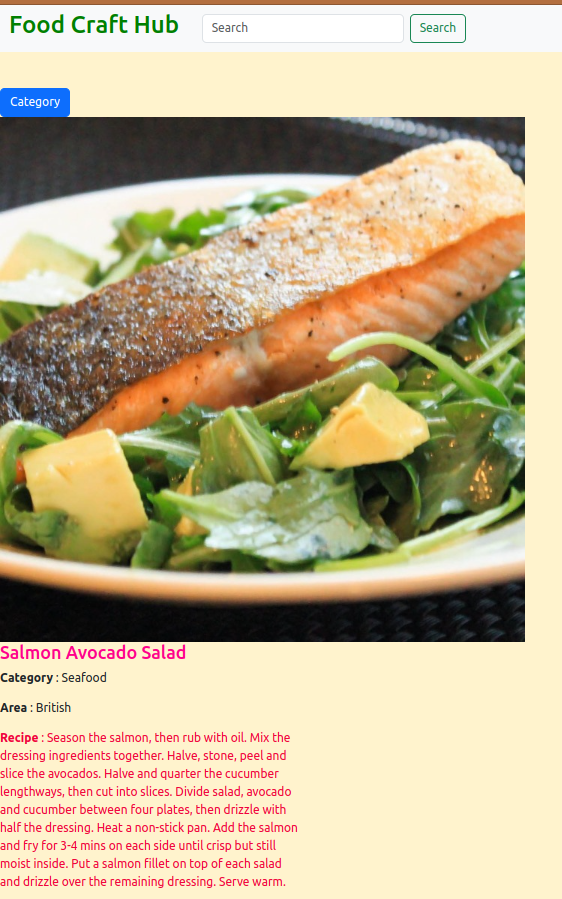
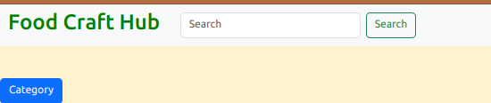
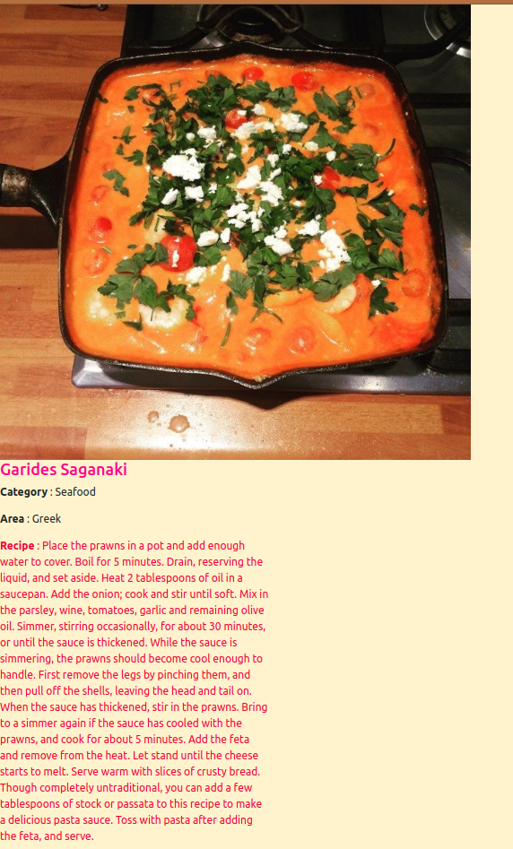
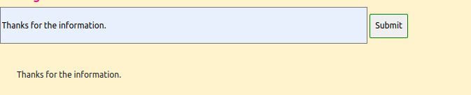

# Food-Craft-Hub
Food craft Hub is a meal based application that enables one to get a list of categories of the meals available,
and also show a random meal, and when clicked it displays more about the random meal, including:
* Category 
* the area the food is was brought about
* recipe
## Project Description 
> This project is based on communicating with an external server that is the API and getting 
a promise from the Get request either rejected or the information specified on the request.
> After getting a promise either the request was succesfull or *NOT* we display the information 
on the DOM which is dom manipulation.
> After displaying the infomation on the DOM we add interactivity to the elemets.

## Author

  * [irungudennis](https://github.com/irungudenninganga)

## Acknowledgment
[The mealDB](https://www.themealdb.com/api.php)
[Bootstrap](https://getbootstrap.com/docs/5.3/getting-started/introduction/)

## Run locally
first start by making a copy of the project on your GitHub account by forking and clone it to the local computer to be able to access the project

Go to the terminal and to the directory where the copy exist on the local machine.


```bash
  cd Food-Craft-Hub
```

open folder in text editor 

```bash
  code .
```
* Open the index.html file on the browser 


Follow the instruction above to use and run the project localy. 

## How the project works
> Fist is that one can access any meal avalable on the MealDB via the search bar by simply making a search request
  a responce will be returned on the DOM either 
  * image of the meal requested 
  * name of the meal 
  * category of the meal
  * recipe to make the dish
  

> *NB* if no results its found note that there will be no interactivity 

> To view the category of food available simply click the 'category' button


> By defult the browser will display a random meal, if intrested in knowing more about the meal simply 
  make a click at the image
  

> To leave a comment simply enter the comment section type your comment and click the submit button and the 
  comment will be simply displayed on the DOM

  


